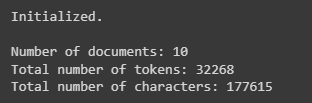
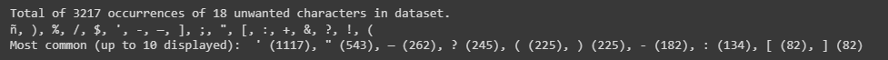
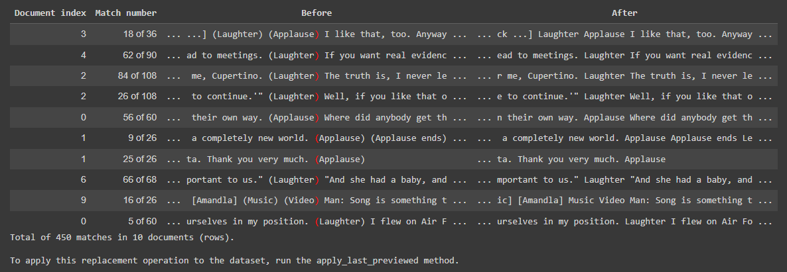
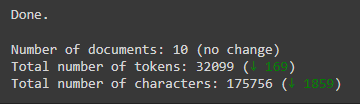
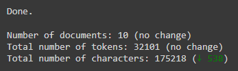
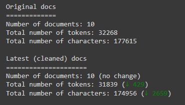
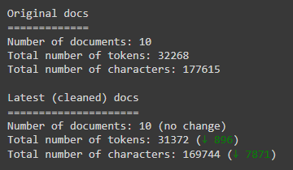
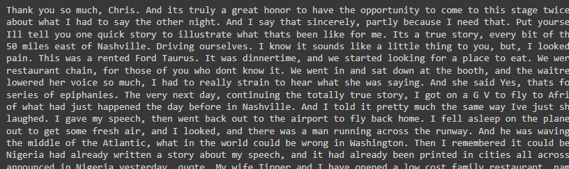
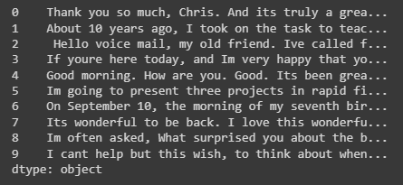

# Text Data Cleaner

A Python library for cleaning text data for use in machine learning and natural language processing applications.

Designed to be used in IPython notebooks (Jupyter, Google Colab, etc.).

Developed and used for the paper "Comparison of Token- and Character-Level Approaches to Restoration of Spaces, Punctuation, and Capitalization in Various Languages", which is scheduled for publication in December 2022.

## Interactive demo

The quickest and best way to get acquainted with the library is through the interactive demo [here](https://colab.research.google.com/drive/1tXnlmjPEzJx1ZNAAVXcvP3N2Q-kxpsQL?usp=sharing), where you can walk through the steps involved in using the library and clean some sample data from the Ted Talks dataset used in the paper.

Alternatively, scroll down for instructions on getting started and basic documentation.

## Getting started

### Install the library using `pip`

```
!pip install git+https://github.com/ljdyer/Text-Data-Cleaner.git
```

### Import the `TextDataCleaner` class

```python
from text_data_cleaner import TextDataCleaner
```

## Cleaning data using the `TextDataCleaner` class

### Initialize an instance of the `TextDataCleaner` class

#### `TextDataCleaner.__init__`

```python
    # ====================
    def __init__(self,
                 docs: Union[List, pd.Series],
                 normalize_spaces: bool = True):
        """Initialize an instance of the class

        Args:
          docs (Union[List, pd.Series]):
            The list of documents to clean.
          normalize_spaces (bool, optional):
            Whether or not to replace two or more subsequent spaces with a
            single space after carrying out each operation. Defaults to True.
        """
```

#### Example usage:

```python
my_fre = FeatureRestorationEvaluator(
    data_cleaner = TextDataCleaner(data['transcript'])
)
```

</img>

### Show unwanted characters in the dataset

#### `TextDataCleaner.show_unwanted_chars`

```python
    # ====================
    def show_unwanted_chars(self,
                            unwanted_chars: Optional[str] = None):
        """Show unwanted characters in the latest version of the dataset

        Args:
          unwanted_chars (Optional[str], optional):
            A regular expression that matches unwanted characters.
            E.g. r'[^A-Za-z0-9 \.,]'      # noqa: W605
            if you only want alphanumeric characters, spaces, periods,
            and commas in the cleaned dataset.

        Raises:
          ValueError:
            If unwanted_chars has not been set for the class instances and
            is also not passed as a parameter.
        """
```

#### Example usage:

```python
data_cleaner.show_unwanted_chars(unwanted_chars = r'[^A-Za-z0-9 \.,]')
```

</img>

### Preview a regex replacement operation

#### `TextDataCleaner.preview_replace`

```python
    # ====================
    def preview_replace(self,
                        find_replace: Tuple[str],
                        num_samples: int = 10,
                        context_chars_before_after: int = 25):
        """Preview the effect of carrying out a regular expression replacement
        operation on the dataset.

        Args:
          find_replace (Tuple[str]):
            A tuple (find, replace) of the regular expression find and replace strings.
            Examples:
                (r'[\(|\)]', '')    # noqa W605
                (r'([0-9]+):([0-9]+)', r'\1 \2')
            The tuple can also have an optional third element, which will be treated as
            a note and displayed when showing operation history.
          num_samples (int, optional):
            The number of samples (locations in documents where a replacement would take place)
            to display. Defaults to 10.
          context_chars_before_after (int, optional):
            The number of characters to display before and after the replacement location in
            each sample. Defaults to 25.
        """
```

#### Example usage:

```python
data_cleaner.preview_replace((r'[\(|\)]', ''))
```

</img>

### Apply the last previewed replacement operation

#### `TextDataCleaner.apply_last_previewed`

```python
    # ====================
    def apply_last_previewed(self, note: Optional[str] = None):
        """Apply the most recently previewed replacement operation.

        Args:
          note (Optional[str], optional):
            A note to describe the replacement operation to display
            when viewing the operation history. Defaults to None.
        """
```

#### Example usage:

```python
data_cleaner.apply_last_previewed()
```

</img>

### Apply one or more replacement operations without previewing

#### `TextDataCleaner.replace`

```python
    # ====================
    def replace(self,
                find_replace: Union[List[Tuple], Tuple],
                verbose_mode: bool = True):
        """Perform a regular expression replacement operation on the whole
        dataset.

        Args:
          find_replace (Union[List[Tuple], Tuple]):
            A tuple (find, replace) of regular expression find and replace strings,
            or a list of such tuples.
            Examples of (find, replace) tuples:
                (r'[\(|\)]', '')    # noqa W605
                (r'([0-9]+):([0-9]+)', r'\1 \2')
            Tuples can also have an optional third element, which will be treated as
            a note and displayed when showing operation history.
          verbose_mode (bool, optional):
            Whether to display information about empty documents that were dropped
            and new counts following the replacement operation. Defaults to True.
        """
```

#### Example usage:

```python
data_cleaner.replace([
    (r'"', r''),
    (r'&', r' and '),
    (r':', r',')
])
```

</img>

### Normalize unicode characters to their ASCII equivalents

#### `TextDataCleaner.normalize_unicode_to_ascii`

```python
    # ====================
    def normalize_unicode_to_ascii(self):
        """Normalize all unicode characters in the dataset to their ASCII
        equivalents.

        Replaces accented characters with their non-accented equivalents and
        removes other non-ASCII characters.
        """
```

#### Example usage:

```python
data_cleaner.normalize_unicode_to_ascii()
```

### Show the history of operations carry out so far

#### `TextDataCleaner.show_operation_history`

```python
    # ====================
    def show_operation_history(self):
        """Display the history of operations carried out on the dataset.
        """
```

#### Example usage:

```python
data_cleaner.show_operation_history()
```

</img>

### Reapply all operations in the history from scratch to the original dataset

#### `TextDataCleaner.refresh_latest_docs`

```python
    # ====================
    def refresh_latest_docs(self):
        """Sync the latest version of the documents with the operation
        history by applying all operations in the history to the original
        dataset from scratch.

        Should be carried out after making any direct changes to the
        operation_history attribute of an instance.
        """
```

#### Example usage:

```python
data_cleaner.refresh_latest_docs()
```

</img>

### Load previously saved operation history from a pickle file

#### `TextDataCleaner.load_operation_history`

```python
    # ====================
    def load_operation_history(self, pickle_path: str):
        """Load previously saved operation history from a pickle file.

        Args:
          pickle_path (str):
            Path or URL to the pickle file containing the operation history
        """
```

#### Example usage:

```python
data_cleaner.load_operation_history(operations_pickle_path)
```

</img>

### Show the latest version of a document from the dataset

#### `TextDataCleaner.show_doc`

```python
    # ====================
    def show_doc(self, doc_idx: int):
        """Display the latest version of a document in the dataset.

        Args:
          doc_idx (int):
            The index of the document in the dataset.
        """
```

#### Example usage:

```python
data_cleaner.show_doc(0)
```

</img>

### Get the latest (cleaned) version of the dataset

#### `TextDataCleaner.get_latest_documents`

```python
    # ====================
    def get_latest_documents(self,
                             as_pandas_series: bool = False
                             ) -> Union[list, pd.Series]:
        """Get the latest version of the dataset as either a list or
        pandas series.

        Args:
          as_pandas_series (bool, optional):
            Whether to convert the list of cleaned document to a pandas series
            before returning. Defaults to False.

        Returns:
          Union[list, pd.Series]:
            The latest version of the dataset as either a list or
            pandas series.
        """
```

#### Example usage:

```python
data_cleaner.get_latest_documents(as_pandas_series=True)
```

</img>