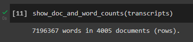
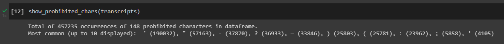
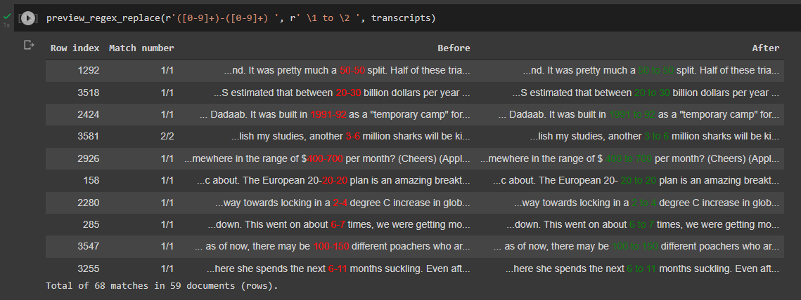
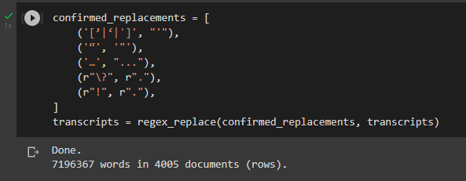
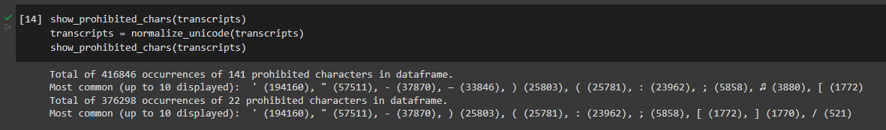

# Text data cleaner

Helper functions for cleaning text data in a pandas dataframe in Google Colab.

## How to use

The recommended method to save and import the `text_data_cleaner` module into a Google Colab notebook is:

```python
url = 'https://raw.githubusercontent.com/ljdyer/text-data-cleaner/main/text_data_cleaner.py'
!wget --no-cache -backups=1 'text_data_cleaner.py' {url}

import text_data_cleaner
from text_data_cleaner import *
```

(Method A.2.1 in https://colab.research.google.com/github/jckantor/cbe61622/blob/master/docs/A.02-Downloading_Python_source_files_from_github.ipynb)

You may find that changes are not reflected when new versions are released. This can usually be resolved by selecting "Runtime" > "Reset factory runtime" in the Google Colab menu. Check the version you are using by running `help(text_data_cleaner)`.

## Functions

The example usage screenshots in this section are from a project where I had to reduce text data from transcripts of TED Talks to leave only the characters a-z, A-Z, 0-9, space, comma, and period. You can see the full notebook [here](clean_ted_talks.ipynb).

### show_doc_and_word_counts

```python
# ====================
def show_doc_and_word_counts(df: pd.DataFrame,
                             text_column_name: str = 'Text'):

    """Show the number of documents (rows) and words in a text column of a
    pandas dataframe.

    Words are defined simply as consecutive chains of non-whitespace characters
    (because word tokenizing takes time!)

    Required arguments:
    -------------------
    df: pd.DataFrame                    A dataframe with a text column

    Optional keyword arguments:
    ---------------------------
    text_column_name: str = 'Text'      The name of the text column in the
                                        dataframe
    """
```

Example usage: 

</img>

### show_prohibited_chars

```python
def show_prohibited_chars(df: pd.DataFrame,
                          prohibited_chars_re: str = r'[^A-Za-z0-9 \.,]',
                          text_column_name='Text',
                          print_all=False
                          ) -> pd.DataFrame:

    """Print information about the occurrence of prohibited characters in the
    text column of your dataframe

    Required arguments:
    -------------------
    df: pd.DataFrame                    A dataframe with a text column

    Optional keyword arguments:
    ---------------------------
    prohibited_chars_re: str = r'[^A-Za-z0-9 \.,]'
                                        A regex that matches prohibited
                                        characters
    text_column_name: str = 'Text'      The name of the text column in the
                                        dataframe
    print_all: bool = False             If True, prints a list of all of the
                                        (unique) prohibited characters in the
                                        text column
    """
```

Example usage: 

</img>

### preview_regex_replace

```python
def preview_regex_replace(find_re: str,
                          replace_re: str,
                          df: pd.DataFrame,
                          text_column_name: str = 'Text',
                          num_samples: int = 10,
                          context_chars_before_after: int = 25,
                          norm_spaces: bool = True):

    r"""Preview the effects of a regex replace operation on your dataframe
    before you apply it.

    Required arguments:
    -------------------
    find_re: str                        The regex to find e.g. r'\((\w)\)'
    replace_re: str                     The regex to replace it with e.g. r'\1'
    df: pd.DataFrame                    A dataframe with a text column

    Optional keyword arguments:
    ---------------------------
    text_column_name: str = 'Text'      The name of the text column in the
                                        dataframe
    num_samples: int = 10               The number of example replacements to
                                        display
    context_chars_before_after: int = 25
                                        The number of characters to display
                                        before and after the match in each
                                        example
    norm_spaces: bool = True,           If True, normalizes spaces after
                                        performing replacement
    """
```

Example usage:

</img>

### regex_replace

```python
def regex_replace(regex_list: list,
                  df: pd.DataFrame,
                  text_column_name: str = 'Text',
                  norm_spaces: bool = True,
                  drop_empty_rows: bool = True
                  ) -> pd.DataFrame:

    """Perform a sequence of one or more regex replace operations on all cells
    in the text column of your dataframe

    Required arguments:
    -------------------
    regex_list: list                    A list of (find, replace) tuples
                                        e.g. (r'\(\w+\)', r'')
    df: pd.DataFrame                    A dataframe with a text column

    Optional keyword arguments:
    ---------------------------
    text_column_name: str = 'Text'      The name of the text column in the
                                        dataframe
    norm_spaces: bool = True,           If True, normalizes spaces after
                                        performing replacement
    drop_empty_rows: bool = True        If True, drops any rows with empty
                                        strings following replacement
    """
```

Example usage:

</img>

### normalize_unicode

```python
def normalize_unicode(df: pd.DataFrame,
                      text_column_name='Text'
                      ) -> pd.DataFrame:

    """Normalize unicode characters (replace accented characters with their
    non-accented equivalents & remove other non-ascii characters) in all cells
    in the text column of your dataframe.

    Required arguments:
    -------------------
    df: pd.DataFrame                    A dataframe with a text column

    Optional keyword arguments:
    ---------------------------
    text_column_name: str = 'Text'      The name of the text column in the
                                        dataframe
    """
```

Example usage:

</img>