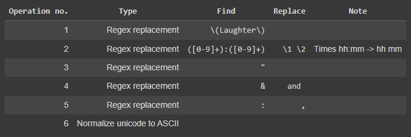
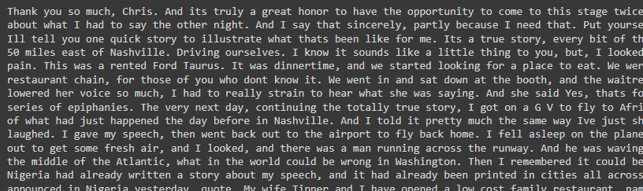
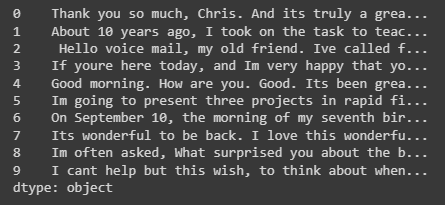

[-^TARGET=README.md
[-^TDC=text_data_cleaner/text_data_cleaner.py
# Text Data Cleaner

A Python library for cleaning text data for use in machine learning and natural language processing applications

Designed to be used in IPython notebooks (Jupyter, Google Colab, etc.).

Developed and used for the paper "Comparison of Token- and Character-Level Approaches to Restoration of Spaces, Punctuation, and Capitalization in Various Languages", which is scheduled for publication in December 2022.

## Interactive demo

The quickest and best way to get acquainted with the library is through the interactive demo [here](https://colab.research.google.com/drive/1tXnlmjPEzJx1ZNAAVXcvP3N2Q-kxpsQL?usp=sharing), where you can walk through the steps involved in using the library and clean some sample data from the Ted Talks dataset used in the paper.

Alternatively, scroll down for instructions on getting started and basic documentation.

## Getting started

### Install the library using `pip`

```
!pip install git+https://github.com/ljdyer/Text-Data-Cleaner.git
```

### Import the `TextDataCleaner` class

```python
from text_data_cleaner import text_data_cleaner
```

## Clean data using the `TextDataCleaner` class

### Initialize an instance of the `TextDataCleaner` class

#### `TextDataCleaner.__init__`

[-*func_or_method TDC>__init__

#### Example usage:

```python
my_fre = FeatureRestorationEvaluator(
    data_cleaner = TextDataCleaner(data['transcript'])
)
```

</img>

### Show unwanted characters in the dataset

#### `TextDataCleaner.show_unwanted_chars`

[-*func_or_method TDC>show_unwanted_chars

#### Example usage:

```python
data_cleaner.show_unwanted_chars(unwanted_chars = r'[^A-Za-z0-9 \.,]')
```

</img>

### Preview a regex replacement operation

#### `TextDataCleaner.preview_replace`

[-*func_or_method TDC>preview_replace

#### Example usage:

```python
data_cleaner.preview_replace((r'[\(|\)]', ''))
```

</img>

### Apply the last previewed replacement operation

#### `TextDataCleaner.apply_last_previewed`

[-*func_or_method TDC>apply_last_previewed

#### Example usage:

```python
data_cleaner.apply_last_previewed()
```

</img>

### Apply one or more replacement operations without previewing

#### `TextDataCleaner.replace`

[-*func_or_method TDC>replace

#### Example usage:

```python
data_cleaner.replace([
    (r'"', r''),
    (r'&', r' and '),
    (r':', r',')
])
```

</img>

### Normalize unicode characters to their ASCII equivalents

#### `TextDataCleaner.normalize_unicode_to_ascii`

[-*func_or_method TDC>normalize_unicode_to_ascii

#### Example usage:

```python
data_cleaner.normalize_unicode_to_ascii()
```

### Show the history of operations carry out so far

#### `TextDataCleaner.show_operation_history`

[-*func_or_method TDC>show_operation_history

#### Example usage:

```python
data_cleaner.show_operation_history()
```

</img>

### Reapply all operations in the history from scratch to the original dataset

#### `TextDataCleaner.refresh_latest_docs`

[-*func_or_method TDC>refresh_latest_docs

#### Example usage:

```python
data_cleaner.refresh_latest_docs()
```

</img>

### Load previously saved operation history from a pickle file

#### `TextDataCleaner.load_operation_history`

[-*func_or_method TDC>load_operation_history

#### Example usage:

```python
data_cleaner.load_operation_history(operations_pickle_path)
```

</img>

### Show the latest version of a document from the dataset

#### `TextDataCleaner.show_doc`

[-*func_or_method TDC>show_doc

#### Example usage:

```python
data_cleaner.show_doc(0)
```

</img>

### Get the latest (cleaned) version of the dataset

#### `TextDataCleaner.get_latest_documents`

[-*func_or_method TDC>get_latest_documents

#### Example usage:

```python
data_cleaner.get_latest_documents(as_pandas_series=True)
```

</img>

